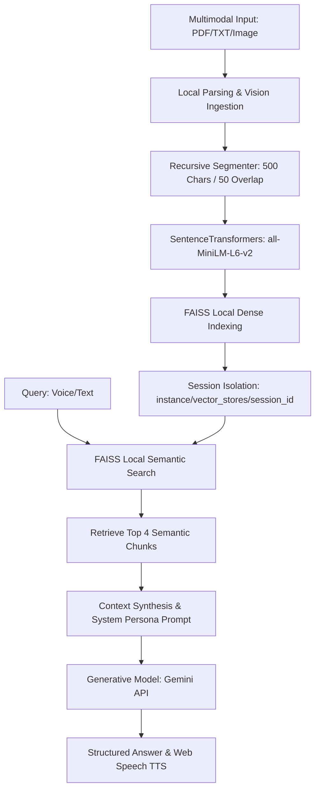

# Raplica AI: Multimodal Edge-Capable RAG & Conversational Platform

Raplica AI is a containerized, low-latency Retrieval-Augmented Generation (RAG) conversational platform designed for **edge-capable, low-overhead environments**. It integrates multimodal image processing, database-backed authentication, session persistence, and local session-isolated vector indexing using FAISS and Hugging Face sentence embeddings.

This architecture showcases design principles key to **Edge-AI systems (e.g., Tesla Autopilot/Infotainment and Optimus interfaces)**: local execution, minimal network dependencies, low-latency dense search, and multimodal query chaining (Audio-to-Text-to-Context-to-Speech).

---

## 🏗️ System Architecture

The pipeline is optimized for minimal query latency, executing tokenization, vector search, and context formatting locally before communicating with the generative LLM.



---

## 🏎️ Edge-AI & Systems Design Decisions (Tesla Alignment)

### 1. Local Vector Search via FAISS (Facebook AI Similarity Search)
- **Edge Rationale**: Rather than relying on network-bound, high-latency cloud vector databases (which are unsuitable for vehicles or robots operating in degraded network environments), this project utilizes **local FAISS indices**. 
- **Performance**: FAISS performs vector clustering and $L_2$ distance queries directly in-memory on CPU, enabling sub-millisecond retrieval times.
- **Index Persistence**: Indicies are serialized and persisted locally (`index.faiss` and `index.pkl`) per session, ensuring fast loading and strict state isolation.

### 2. Multi-Modal Vision Ingestion
- **Vision Integration**: In addition to text document RAG, the architecture supports raw image uploads (`PNG`/`JPG`). Images are processed using PIL and sent directly to the Gemini vision pipeline, showcasing multimodal inputs.
- **Applications**: This demonstrates a basic framework for visual grounding and spatial/environmental questioning, critical for robotics (Optimus) and visual perception systems.

### 3. Audio & Voice Agent Chaining (Infotainment / Voice-Command)
- **Audio pipeline**: Integrates Streamlit's native `st.audio_input` to capture raw WAV/WebM voice commands.
- **Chained Inference**: 
  1. **Transcription Stage**: Raw audio bytes are sent to Gemini to obtain a clean transcription in the spoken language.
  2. **Retrieval Stage**: The transcribed query is run against the local FAISS index to find context.
  3. **Generation Stage**: Context is combined with system prompt instructions and generated into a final response.
  4. **Speech Synthesis**: Client-side JavaScript triggers Web Speech synthesis to read responses out loud.
- **Tesla Use Case**: Simulates the pipeline for real-time, low-latency in-car voice commands or human-robot interaction commands for the Optimus humanoid robot.

### 4. Build-Time Dependency & Model Baking
To optimize container initialization times, the model weight caching is shifted to the **Docker image build phase**:
```dockerfile
RUN python -c "from langchain_huggingface import HuggingFaceEmbeddings; HuggingFaceEmbeddings(model_name='sentence-transformers/all-MiniLM-L6-v2')"
```
- **Benefit**: Downloading the 120MB embeddings model during the build stage means the container starts up and serves queries instantly at runtime without downloading weights.

---

## 🛠️ Infrastructure & CI/CD Pipeline

- **GitHub Actions CI/CD**: Automatically builds and mirrors the codebase to Hugging Face Spaces on every push to the `main` branch.
- **Dockerized Deployments**: Uses a containerized build to ensure environment reproducibility across cloud or edge nodes.

---

## 🚀 Setup & Installation

### Local Development Setup

1. **Clone and Configure Environment**:
   ```bash
   git clone https://github.com/techindro/techindro-ai-chatbot.git
   cd techindro-ai-chatbot
   ```
   Create a `backend/.env` file:
   ```text
   GEMINI_API_KEY=your_api_key_here
   PORT=7860
   ```

2. **Install Dependencies**:
   Ensure you have Python 3.9+ installed. Run:
   ```bash
   pip install -r requirements.txt
   ```

3. **Start the Streamlit Application**:
   ```bash
   streamlit run techindro-ai-chatbot/streamlit_app.py --server.port 8501
   ```
   Open your browser to `http://localhost:8501`.
